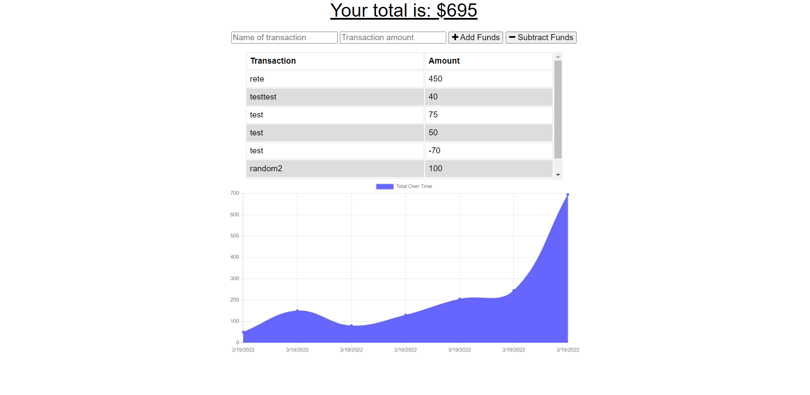

# Budget Tracker

# Description
The purpose of this project was to practice converting an existing application into a PWA by adding a service worker, using IndexedDB to keep track of data when the application is offline, and adding a manifest.json file. 

# Technologies
* Service-Workers
* IndexedDB
* Web manifests

# Screenshots/Links

Deployed Application:

# Credits
Miranda Lane

